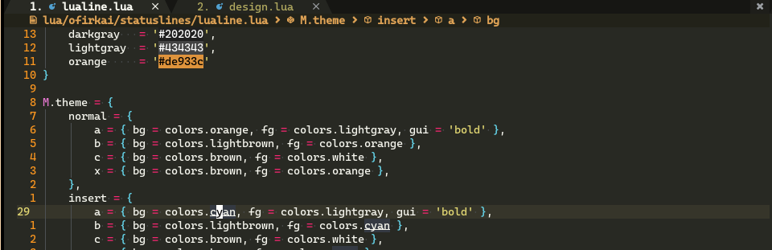
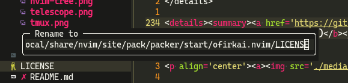
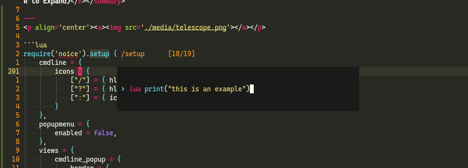
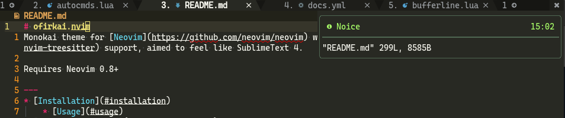

# ofirkai.nvim
Monokai theme for [Neovim](https://github.com/neovim/neovim) with [treesitter](https://github.com/nvim-treesitter/nvim-treesitter) support, aimed to feel like SublimeText 4.

Requires Neovim 0.8+

---
* [Installation](#installation)
	* [Updates](#updates)
	* [Usage](#usage)
* [Supported Plugins](#supported-plugins)
	* [Status Lines](#status-lines)
	* [Winbars](#winbars)
	* [Tab Lines](#tab-lines)
	* [Others](#others)
* [Contributing](#contributing)
---

<p align='center'><a></a></p>

## Why not [monokai.nvim](https://github.com/tanvirtin/monokai.nvim)?
Before I used Neovim I used Sublime Text for 6 years with the builtin Monokai scheme.

My eyes got used to the monokai colorscheme and I didn't want to change what I used to, so the first thing I did when I transferred to Neovim was searching for a Monokai colorscheme.

I found [monokai.nvim](https://github.com/tanvirtin/monokai.nvim) and installed it immediately, unfortunately it wasn't 1:1 to Sublime Text, I tinkered some values through the config and achieved a colorscheme I was happy with.

I kept adding support for other plugins and changing the default values of [monokai.nvim](https://github.com/tanvirtin/monokai.nvim). A colleague of mine asked which colorscheme I use and how can he install it, I answered it was my customized monokai colorscheme, hence the name ofirkai.


## Installation
```lua
use 'ofirgall/ofirkai.nvim'
```

### Updates
ofirkai is my daily driver, I update it for my needs. New plugins I use will be added, and some changes might be added, I recommend watching the repo to keep notified (click on `Watch`).

In addition, you can follow the experimental branch `exp` to get experimental updates (if they don't break anything and I liked the change the changes will be merged to `master` within a week or so).
```lua
use { 'ofirgall/ofirkai.nvim', branch = 'exp' }
```

### Usage
```lua
-- Leave empty for default values
require('ofirkai').setup {
}

-- Or setup with custom parameters
require('ofirkai').setup {
	scheme = require('ofirkai').scheme -- Option to override scheme
	custom_hlgroups = {},              -- Option to add/override highlight groups
	remove_italics = false,            -- Option to change all the italics style to none
}
```

You can find the default values for the scheme and highlights in [design.lua](https://github.com/ofirgall/ofirkai.nvim/blob/master/lua/ofirkai/design.lua).

_**Note**_: Each plugin that need a setup has an example in the collapsible section.

#### Additional highlight groups
ofirkai adds additional highlight groups to help configure other plugins.
* `InlayHints` - For InlayHints.
* `WhiteBorder` - For floating windows that utilize the border for text, [dressing.nvim](https://github.com/stevearc/dressing.nvim).

## Supported Plugins
There is a screenshot example for each plugin.

### Status Lines
<details><summary><a href='https://github.com/nvim-lualine/lualine.nvim'>lualine.nvim</a> - <b>Custom setup required (Click to Expand)</b></summary>

---
<p align='center'><a></a></p>
<p align='center'><a></a></p>
<p align='center'><a></a></p>
<p align='center'><a></a></p>

**Setup Example:**
```lua
require('lualine').setup {
	options = {
		theme = require('ofirkai.statuslines.lualine').theme,
	}
}
```
---
</details>

### Tab Lines
<details><summary><a href='https://github.com/akinsho/bufferline.nvim'>bufferline.nvim</a> - <b>Custom setup required (Click to expand)</b></summary>

---
<p align='center'><a></a></p>

Setup Example:
```lua
-- bufferline.nvim, must be loaded after color scheme (working on that https://github.com/ofirgall/ofirkai.nvim/issues/2)
require('bufferline').setup {
	highlights = require('ofirkai.tablines.bufferline').highlights, -- Must
	options = { -- Optional, recommended
		themable = true, -- Must
		separator_style = 'slant',
		offsets = { { filetype = 'NvimTree', text = 'File Explorer', text_align = 'center' } },
		show_buffer_icons = true,
		numbers = 'ordinal',
		max_name_length = 40,
	},
}
```
---
</details>

### Winbars
<details><summary><a href='https://github.com/nvim-lualine/lualine.nvim'>lualine.nvim</a> - <b>Custom setup required (Click to Expand)</b></summary>

---
<p align='center'><a></a></p>

Setup Example:
```lua
-- Unfortunately you can't set them for winbar separately in lualine so I use `color` in my winbar sections

-- SmiteshP/nvim-navic (displays function context)
local navic = require('nvim-navic')
navic.setup {
	separator = "  "
}

local ofirkai_lualine = require('ofirkai.statuslines.lualine')
local winbar = {
	lualine_a = {},
	lualine_b = {
		{
			'filename',
			icon = '',
			color = ofirkai_lualine.winbar_color,
			padding = { left = 4 }
		},
	},
	lualine_c = {
		{
			navic.get_location,
			icon = "",
			cond = navic.is_available,
			color = ofirkai_lualine.winbar_color,
		},
	},
	lualine_x = {},
	lualine_y = {},
	lualine_z = {}
}

require('lualine').setup {
	options = {
		icons_enabled = true,
		disabled_filetypes = { -- Recommended filetypes to disable winbar
			winbar = { 'gitcommit', 'NvimTree', 'toggleterm', 'fugitive' },
		},
	},
	winbar = winbar,
	inactive_winbar = winbar,
}
```
---
</details>

### Others
<details><summary><a href='https://github.com/hrsh7th/nvim-cmp'>nvim-cmp</a> - <b>Custom setup is Optional (Click to expand)</b></summary>

---
<p align='center'><a></a></p>

```lua
require('cmp').setup({
	window = require('ofirkai.plugins.nvim-cmp').window, -- I just removed the `FloatBorder:Normal` from the highlights to allow the FloatBorder to be colored, its not a must.

	-- Get lsp icons from ofirkai, requires https://github.com/onsails/lspkind.nvim
	formatting = {
		format = lspkind.cmp_format({
			symbol_map = require('ofirkai.plugins.nvim-cmp').kind_icons,
			maxwidth = 50,
			mode = 'symbol'
		})
	},

})
```
---
</details>

<details><summary><a href='https://github.com/stevearc/dressing.nvim'>dressing.nvim</a> - <b>Custom setup required (Click to expand)</b></summary>

---
<p align='center'><a></a></p>

Setup Example:
```lua
-- Requires `WhiteBorder` to show the title.
require('dressing').setup {
    input = {
        winhighlight = require('ofirkai.plugins.dressing').winhighlight
    }
}
```
---
</details>

<details><summary><a href='https://github.com/kyazdani42/nvim-tree.lua'>nvim-tree.lua</a> - Click to expand</summary>

---
<p align='center'><a></a></p>

---
</details>

<details><summary><a href='https://github.com/nvim-telescope/telescope.nvim'>telescope.nvim</a> - Click to expand</summary>

---
<p align='center'><a></a></p>

---
</details>

<details><summary><a href='https://github.com/folke/noice.nvim'>noice.nvim</a> - <b>Custom setup is Optional (Click to Expand)</b></summary>

---
<p align='center'><a></a></p>

```lua
require('noice').setup {
    popupmenu = {
        enabled = false, -- I prefer nvim-cmp
    },
    lsp = {
        signature = {
            enabled = false -- I prefer to use ray-x/lsp_signature.nvim with minimal design
        },
        override = {
            -- Override `vim.lsp.buf.hover` and `nvim-cmp` doc formatter with `noice` doc formatter.
            ['vim.lsp.util.convert_input_to_markdown_lines'] = true,
            ['vim.lsp.util.stylize_markdown'] = true,
            ['cmp.entry.get_documentation'] = true,
        },
    },
}
```

---
</details>

<details><summary><a href='https://github.com/rcarriga/nvim-notify'>nvim-notify</a> - <b>Custom setup is Optional (Click to Expand)</b></summary>

---
<p align='center'><a></a></p>

```lua
require('notify').setup {
    background_colour = require('ofirkai').scheme.ui_bg,
}
```

---
</details>

<details><summary><a href='https://github.com/sindrets/diffview.nvim'>diffview.nvim</a> - Click to expand</summary>

---
<p align='center'><a></a></p>

---
</details>

<details><summary><a href='https://github.com/lewis6991/gitsigns.nvim'>gitsigns.nvim</a> - Click to expand</summary>

---
<p align='center'><a></a></p>

---
</details>

<details><summary><a href='https://github.com/nvim-treesitter/nvim-treesitter-context'>nvim-treesitter-context</a> - Click to expand</summary>

---
<p align='center'><a></a></p>

---
</details>


<details><summary><a href='https://github.com/ray-x/lsp_signature.nvim'>lsp_signature.nvim</a> - Click to expand</summary>

---
I don't change the highlight group because I use a minimalistic design for the lsp signature you can adapt it.

<p align='center'><a></a></p>

```lua
local lsp_signature_cfg = {
	bind = true,
	use_lspsaga = false,
	doc_lines = 0,
	floating_window = false,
	hint_scheme = 'LspSignatureHintVirtualText',
	hint_prefix = ' ',
}
```
---
</details>

<details><summary><a href='https://github.com/o0th/tmux-nova/blob/master/Gallery.md#gruvbox'>tmux status bar</a> - Click to expand</summary>

---
<p align='center'><a></a></p>

---
</details>

## Full setup example
[ui.lua](https://github.com/ofirgall/dotfiles/blob/master/editors/nvim/lua/plugins/ui.lua) from my dotfiles.

## Contributing
Pull requests are welcome, you must provide a screenshot of before/after the change.
